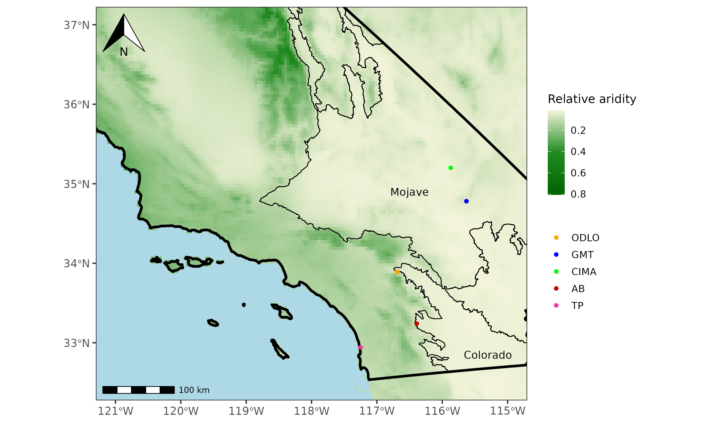

# Studies of moss biocrust mycobiome across an aridity gradient: bryophyte-fungal associations structured by climate

This is a repository for all code related to moss biocrust mycobiome studies across an aridity gradient including Glomeromycete specific analyses and general fungal diversity. See collection sites in the map below:

### Preliminary abstract

Drylands are fragile biomes comprising approximately 40% of Earth's land area. They are defined by their lack of water availability due to rare and irregular precipitation, extreme temperatures, and low soil fertility. Drylands are predicted to increase in land area by a total of 56% by the end of the century, an effect which is particularly pronounced in the Western United States. Drylands are also expected to become increasingly arid as climate change progresses. Biological soil crusts (biocrusts) are dubbed the "living skin" of dry lands and can cover up to 70% of these biomes. Biocrusts are intricate communities of cyanobacteria, microfungi, algae, lichen, and bryophytes which aggregate the top millimeters of soil. They perform critical ecosystem services including water retention, nutrient cycling, preventing erosion, and carbon sequestration. They contain some of the most ancient life forms on the planet, including early divergent fungi and bryophytes. Here, we survey the moss biological soil crust mycobiome pre and post surface sterilization across an aridity gradient. The survey reveals a high species level diversity in extreme environments compared to low aridity coastal sites. Moreover, this study provides a strong argument that moss biocrusts are a fungal biodiversity hotspot compared to adjacent dirt and should therefore receive conservation priority. Unexpectedly, arbuscular mycorrhizal fungi (Glomeromycota) experienced enriched relative abundance at coastal sites, suggesting an unprecedented role in biological soil crusts. Staining of moss tissue revealed extensive intracellular colonization by both Ascomycetes and Glomeromycetes in healthy moss tissue. This suggests that, in certain environments, AMF may play an important role in biological soil crusts including supporting the health of the dominant photobiont: moss. These results highlight biocrusts as an ideal system to understand the ecological interactions between early divergent fungi and ancient plants, and the relationship between aridity and fungal biodiversity.

# Bioinformatic pipeline

## Contents

### AMPtk

1.  Preprocessing
2.  OTU/ASV Clustering
3.  Filtering OTUs
4.  Taxonomy Assignment
5.  Functional Annotation (Funguild)
6.  Taxonomy Fixing

### Phyloseq

1.  Alpha Diversity
2.  Beta Diversity
3.  Taxonomic Bar Plots
4.  Log2Fold Plots with DESeq
5.  Heatmaps with Phylogenies

------------------------------------------------------------------------

First, run BCL convert to demultiplex the library. Then, use AMPtk for the following steps:

## AMPtk

### Preprocessing

-   Check if the demultiplexed FASTQ file (`$BASE.demux.fq.gz`) exists.
-   If not, run the AMPtk Illumina pipeline to process the raw data, including merging paired-end reads, removing primers, and filtering sequences based on quality and length.
-   Save the processed output with the base name `$BASE`.

### Clustering

-   Load necessary modules and set up environment variables.
-   Check if the demultiplexed FASTQ file exists. If not, exit with an error message.
-   If the demultiplexed file exists, perform OTU clustering using AMPtk's `amptk cluster` command. Cluster sequences based on similarity, remove chimeric sequences, and generate a list of representative OTU sequences.
-   Same thing for ASVs except uses dada2 to cluster ASVs.
-   Save the clustered OTUs with the base name `$BASE.cluster.otus.fa`.
-   Note, ASVs were used in all figures.

### Filtering OTUs 

-   Check if the filtered OTU sequences file (`$BASE.filtered.otus.fa`) exists.
-   If not, filter OTU sequences based on their abundance in the OTU table using AMPtk's `amptk filter` command.

### Taxonomy Assignment 

-   Check if the taxonomy-assigned OTU table (`$BASE.otu_table.taxonomy.txt`) exists.
-   If not, perform taxonomy assignment to the filtered OTU sequences using AMPtk's `amptk taxonomy` command. Taxonomy is assigned using a reference database for fungal ITS regions.
-   Save the assigned taxonomy as `$BASE.otu_table.taxonomy.txt`.

### Functional Annotation (Funguild) 

-   Check if the Funguild annotations file (`$BASE.guilds.txt`) exists.
-   If not, perform functional annotation using AMPtk's `amptk funguild` command. Funguild assigns ecological guilds to fungal OTUs based on their taxonomy.
-   Save the guild annotations as `$BASE.guilds.txt`.

### Taxonomy Fixing

-   Check if the fixed taxonomy file (`$BASE.taxonomy.fix.txt`) exists.
-   If not, run a Perl script (`rdp_taxonmy2mat.pl`) to fix the taxonomy format. This script is by Jason Stajich.
-   Save the fixed taxonomy file as `$BASE.taxonomy.fix.txt`.
-   This step is required for phyloseq to work.

------------------------------------------------------------------------

## Phyloseq

Phyloseq, ggplot, and ggtree were used for all data visualization purposes. Samples were rarefied based on the lowest sample read count and singletons were removed. Most phyloseq pipelines were adapted from "Insights into dryland biocrust microbiome: geography, soil depth and crust type affect biocrust microbial communities and networks in Mojave Desert, USA", by Pombupba et. al 2019. Be sure to cite him if you use it. 

### Alpha Diversity

#### Description

-   All samples are rarefied based on the sample with the lowest number of reads. Singletons are then removed.
-   Samples are faceted based on substrate or site.
-   Alpha diversity is calculated and plotted using `phyloseq`.

### Beta Diversity

#### Description

-   All samples are rarefied based on the sample with the lowest number of reads. Singletons are then removed.
-   Samples are faceted based on substrate or site.
-   Beta diversity based on Bray Curtis Dissimilarity is calculated and plotted using `phyloseq`.

### Taxonomic Bar Plots

#### Description

-   Taxonomic bar plots are generated to visualize the abundance of taxa at different taxonomic levels.
-   Faceted by fungal class and genus, including Glomeromycetes.
-   ggplot is used to display the plots.
-   Note, the pipeline requires manipulation based on top abundance taxa in your data. You must specify the taxa above 1% relative abundance.

### Log2Fold Plots with DESeq

#### Description

-   Differential abundance analysis is performed using `DESeq`.
-   Log2Fold change plots are generated to visualize differential abundance between conditions, e.g., before and after surface sterilization. The pipeline was adapted from this blog post: [DESeq2](https://joey711.github.io/phyloseq-extensions/DESeq2.html).

### Heatmaps with Phylogenies

#### Description

-   Heatmaps with phylogenies are generated to visualize taxonomic relationships and abundance patterns.
-   Faceted by fungal class and genus, including Glomeromycetes.
-   Block based phylogenetic classification was used based on clustering with NCBI type species

## Citation

If you use this analysis pipeline, please cite the relevant packages and methods used, especially "Insights into dryland biocrust microbiome: geography, soil depth and crust type affect biocrust microbial communities and networks in Mojave Desert, USA", by Pombupba et. al 2019 as he developed many of the pipelines seen here.
